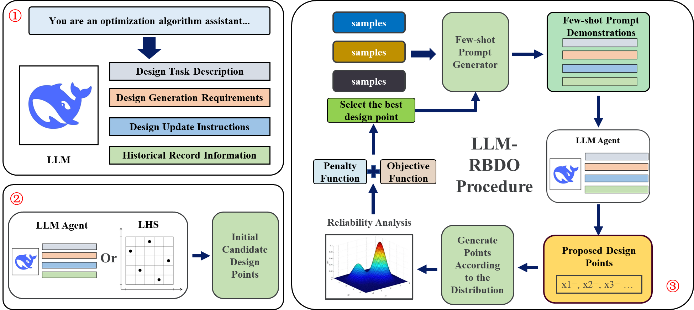

# LLM-RBDO 项目说明

**摘要（English）**
Large language models (LLMs) have demonstrated remarkable in-context learning (ICL) capabilities, enabling flexible utilization of limited historical information to play pivotal roles in reasoning, problem-solving, and complex pattern recognition tasks. Inspired by the successful applications of LLMs in multiple domains, this article proposes a generative design approach by leveraging the ICL capabilities of LLMs with the iterative search mechanisms of metaheuristic algorithms for solving reliability-based design optimization (RBDO) problems. In detail, Kriging surrogate modeling is employed to replace the expensive simulations, and thus Monte Carlo simulation (MCS) can be used to approximate the probability of failure for design alternatives. Then, an RBDO-informed LLM prompt is designed to dynamically provide critical information to the LLMs, which enables the rapid generation of new high-quality design points that satisfy the reliability constraints while improving design efficiency. With the LLMs as a design generator, the RBDO is an iterative process to obtain feasible design solutions with improved performance. With the Deepseek-V3 model, three case studies are used to demonstrate the performance of the proposed approach for solving RBDO problems. The results indicate that the proposed LLM-based generative RBDO approach successfully identifies feasible solutions that meet reliability constraints while achieving a comparable convergence rate compared to traditional genetic algorithms.

**摘要（中文）**
大型语言模型（LLM）展现出卓越的上下文学习（ICL）能力，能够灵活利用有限的历史信息，在推理、问题解决和复杂模式识别任务中发挥关键作用。受 LLM 在多个领域成功应用的启发，本文提出了一种生成式设计方法，该方法结合了 LLM 的 ICL 能力和元启发式算法的迭代搜索机制，用于解决基于可靠性的设计优化（RBDO）问题。具体而言，本文采用克里金代理模型来替代昂贵的仿真，从而可以使用蒙特卡罗模拟（MCS）来近似计算设计方案的失效概率。然后，设计了一个 RBDO 指导的 LLM 提示，动态地向 LLM 提供关键信息，从而能够快速生成满足可靠性约束并提高设计效率的高质量设计点。以 LLM 作为设计生成器，RBDO 是一个迭代过程，旨在获得性能更优的可行设计方案。本文利用 Deepseek-V3 模型，通过三个案例研究来验证所提出的方法在解决可靠性驱动设计（RBDO）问题方面的性能。结果表明，所提出的基于 LLM 的生成式 RBDO 方法能够成功识别满足可靠性约束的可行解，并且与传统遗传算法相比，其收敛速度相当。

## 方法示意图

## 目录结构
- `Case_Study1/`：论文案例一（二维数学案例）。
- `Case_Study2/`：论文案例二（高维数学案例）。
- `Case_Study3/`：论文案例三（三维飞机喷管案例）。
- `Scripts/`：LLM 接口与通用工具脚本（如 `api_client.py`、`llm_ops.py`、提示模板等）。

## 运行环境
- 操作系统：Windows（已在 Windows 上验证）。
- Python：建议 使用 Python 3.12，推荐使用 `uv` 管理依赖(若使用其他版本，可能需要手动安装依赖)。
- ANSYS：本项目使用 Ansys Discovery Geometry 与 Ansys Fluent（PyFluent）。需要本机安装相应版本并配置许可证。
  - 环境变量与许可证：确保 `AWP_ROOT` 或相关 Ansys 环境已正确配置；有可用许可证（Discovery/Fluent）。

## 安装与准备
- 步骤 1：安装 `uv`（依赖管理工具）
  - 官方安装文档：`https://docs.astral.sh/uv/getting-started/installation/`
  - Windows 快速安装示例：
    - `powershell -ExecutionPolicy ByPass -c "irm https://astral.sh/uv/install.ps1 | iex"`
- 步骤 2：克隆项目到本地
  - `git clone https://github.com/backtime1/LLM-RBDO.git`
  - `cd LLM-RBDO`
- 步骤 3：安装依赖（在项目目录下执行）
  - `uv sync`
  - 若使用其它 Python 版本，需要同步修改：
    - 项目根目录下 `.python-version` 为目标版本（当前为 `3.12`）
    - `pyproject.toml:17-18` 中 `geatpy` 的轮子链接，替换为对应 Python 版本的轮子。可在 `https://github.com/geatpy-dev/geatpy/releases/tag/v2.7.0` 查找匹配你版本的平台与 ABI（示例当前使用：`geatpy-2.7.0-cp312-cp312-win_amd64.whl`）。
- 步骤 4：LLM API 配置
  - 建议在系统环境中设置：`OPENAI_API_KEY`、`SILICONFLOW_API_KEY`、`DEEPSEEK_API_KEY`（可选 `OPENAI_BASE_URL`、`SILICONFLOW_BASE_URL`、`DEEPSEEK_BASE_URL`）。
  - 如需自定义或切换供应商逻辑，可编辑 `Scripts/api_client.py`；请勿在代码中硬编码密钥，保持密钥在环境变量或本地安全存储。

## 快速开始（案例 1）
- 进入案例目录：
  - `cd Case_Study1`
- 使用 uv 运行示例脚本：
  - `uv run .\LLM_Kriging`
- 说明：
  - 在此之前请先完成上面的依赖安装（`uv sync`）。
  - 若你使用的 Python 版本不是 3.12，请按“安装与准备”的指引调整 `.python-version` 和 `pyproject.toml` 中的 `geatpy` 轮子链接。

## 论文与引用
- 本项目的技术细节与实验结果请参考已发表论文：
  - Jiang, Z., Gao, S., Tang, Q., Wang, Z., Liu, Y., Huang, H. (2026). Generative Reliability-Based Design Optimization Using In-Context Learning Capabilities of Large Language Models. ASME Journal of Mechanical Design, 148(3): 031705. 链接：https://asmedigitalcollection.asme.org/mechanicaldesign/article-abstract/148/3/031705/1221729/Generative-Reliability-Based-Design-Optimization?redirectedFrom=fulltext

## 许可与致谢
- 许可：本仓库内容（代码、图片与文稿片段）仅用于论文阅览与学术交流，禁止用于任何商业用途、专利申请或作为商业产品的一部分分发；除法律允许的合理使用外，保留所有权利。
- 若需更广泛的学术使用或合作，请先联系作者取得书面授权。
- 致谢：感谢 Ansys 提供的几何与仿真平台，以及相关 Python API。
